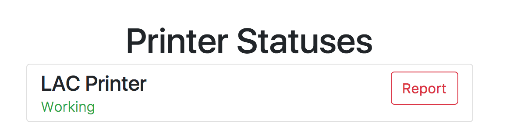
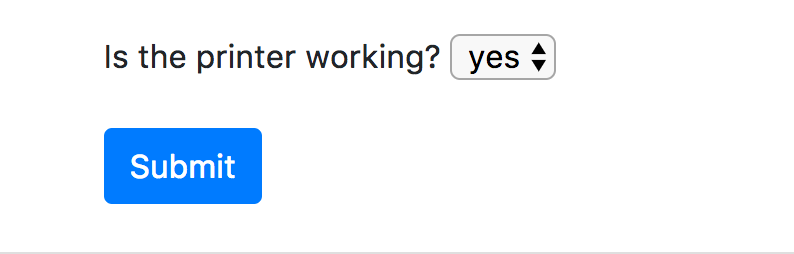
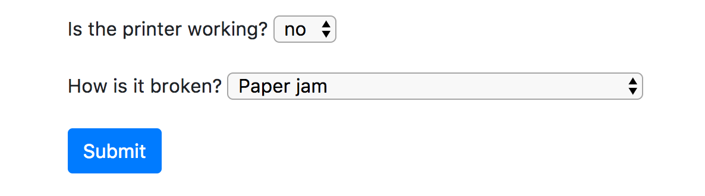
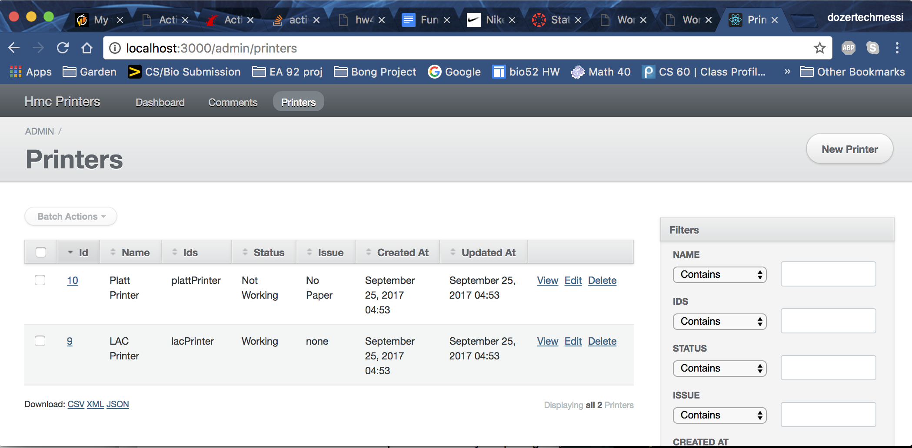
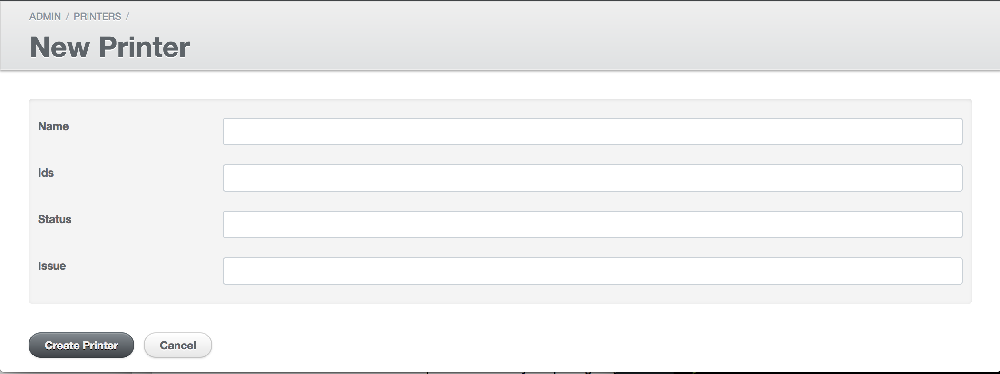

# hmc-printers
A website that crowd sources to determine whether printers on Harvey Mudd's campus are working or not

## Contributors 
Gabby Womark, Teddy Dubno and Katie Erickson

## Summary
Harvey Mudd Colleges has 5 printers that connect to student printing, but often times one or more of the devices is out of order. Students have expressed frustration about not knowing whether or not the printer they are planning on using is functional, so this site aims to serve as an accurate and updated reflection of the status of Harvey Mudd's printers. This site aims to display info as well as take input about the printers on campus, so that whenever a student visits the printer, they can check its status beforehand, and update the status if anything has changed.

## MVP
Our MVP includes a webpage that displays a basic message about the each printer's status on campus, as well as the necessary forms so that somebody can change the printer status if necessary.

## Functionality
The main functionality of Printer Statuses is the user’s ability to report whether a certain printer is working or not and why the printer is not working. Let’s walk through a simple process of creating a report: 

First venture to the [/printers](http://whatever-domain-name/printers) route. Find which printer you want, in this case we’ll report about the LAC Printer, then click on it’s corresponding report button as shown in Fig.1

Fig. 1

After clicking on the report button the following form should drop down:

If the printer is working we simply hit submit, otherwise click the dropdown and select ‘no’. A new entry on the form should appear. From there select the way in which your printer is broken then hit submit.

After clicking submit, the page should refresh and you should see your new report under the printer you just submitted the form for.  

Users can also check out previous statuses for all printers at the /history route. 

Our website also contains some admin functionality. In particular admins can add new printers to add reports for. Admins can also delete printers along with all their statuses with the click of a button. Simply venture to the /admin/printers route, enter the admin credentials, and you’ll see the following: 

To delete a printer, simply click the delete button corresponding with the printer you want to delete. To add a new printer click the "New Printer" button in the top right corner in the picture above. And you’ll get taken to the following page: 

Simply fill in the form above. The **ids** section should be populated with a camel-case version of the printer’s name. The **status** and **issues** sections should be filled in with only with values that are present on their corresponding sections on the report form. We wrap this whole process up by clicking the create printer button. 

And that about sums up the functionality of our app.

## Issues:

We are still developing a mechanism to get feedback on the website and how it is working from its users. This information can be used to suggest features or report issues with the site.

Our stats site is functional in terms of the data it shows, but we have not added the css to the site. We also recognize that after the addition of many statuses to each printer, issues with pagination may arise on the stats page.

**Architecture:  **

There are two major models that we use, Printer and Stats, Printer has a one to many relationship with Stats. The Printer model has a name, ID, status and issue attributes. The Printer model represents the current state of a printer. We use the Printer model to display the status of the printer. The stats model is where we record the history of the printers, so that we can tell which printers are more prone to failure. Stats has an id to correspond with the printer, status, and issue. For admin users there is a separate controller that allows the addition of printers and editing their data fields. 

## References:

Guides.rubyonrails.org. (n.d.). Retrieved September 25, 2017, from http://guides.rubyonrails.org/

Ruby 2.4.2. (n.d.). Retrieved September 25, 2017, from [http://ruby-doc.org/core-2.4.2/](http://ruby-doc.org/core-2.4.2/)

(n.d.). Retrieved September 25, 2017, from http://www.tablesgenerator.com/html_tables#

Learn Ruby on Rails. (n.d.). Retrieved September 25, 2017, from http://www.codecademy.com/courses/learn-rails/

How to show or hide div or form element with jquery? (n.d.). Retrieved September 25, 2017, from https://stackoverflow.com/questions/18778701/how-to-show-or-hide-div-or-form-element-with-jquery

